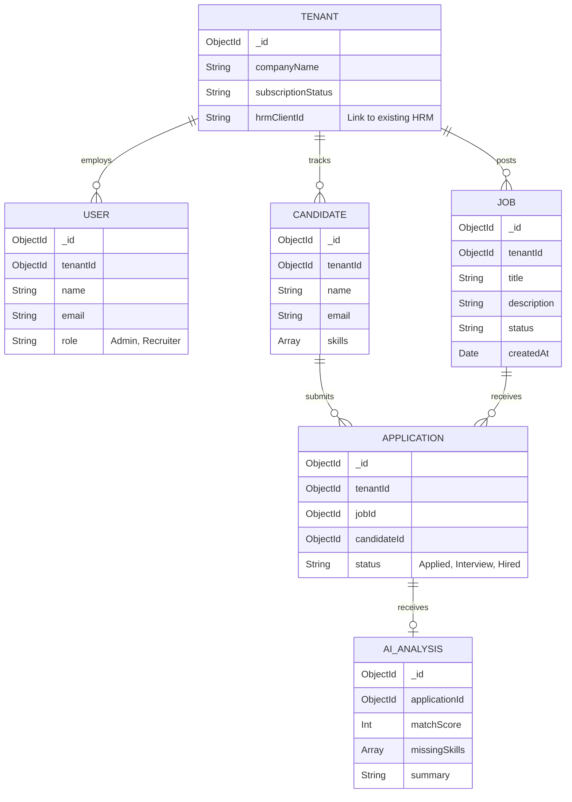

# Multi-Tenant Enterprise Applicant Tracking System (ATS) Plan

This document outlines the architecture, data models, workflows, and strategic decisions for a **Multi-Tenant ATS** designed to be provided as a service to clients currently using your HRM system.

## Goal Description

Plan a scalable, B2B Multi-Tenant Applicant Tracking System. The ATS will be offered as a module/service to your existing HRM clients. It leverages React (Frontend), Node.js/Express (Backend), MongoDB, and Gemini AI for intelligent candidate analysis.

> [!IMPORTANT]
> ## User Review Required: Architecture & Workflow Decisions
> Since we are in the planning stage, we need to decide on the following crucial workflow and architectural choices before writing any code:
> 
> **1. Multi-Tenant Data Isolation Strategy**
> - **Option A (Logical Isolation - Recommended):** A single MongoDB database where every record (Jobs, Candidates, Resumes) has a `tenantId`. This is easier to maintain, cheaper, and faster to query across all tenants (for analytics).
> - **Option B (Database per Tenant):** Each client gets their own separate MongoDB database. This offers strict data isolation (better for certain compliance requirements) but is harder to manage and migrate schemas.
> *Which approach fits your clients' security/compliance needs best?*
> 
> **2. Integration with Existing HRM**
> - **Authentication:** Will the ATS use the *exact same* authentication service as your existing HRM (Single Sign-On), or will it have a separate auth flow?
> - **Frontend Delivery:** Will the ATS be an embedded module within the HRM (e.g., via a Microfrontend or iframe), or a completely separate portal (e.g., `ats.yourhrm.com`)?
> 
> **3. Client Career Pages**
> - Do you want the system to generate a public, white-labeled "Careers Page" for each client (e.g., `jobs.client-domain.com` or `yourhrm.com/client-name/jobs`) where candidates can apply directly?

---

## 1. Multi-Tenant Architecture Overview

To support multiple clients securely and efficiently, we propose a modular architecture:

### Core Services:
- **API Gateway**: Routes traffic and resolves the `tenantId` (e.g., from a subdomain or API token) before forwarding the request to downstream services.
- **Auth & Tenant Service**: Syncs with your existing HRM to manage client subscriptions, tenant boundaries, and recruiter access levels.
- **Job Service**: Manages jobs scoped strictly to the requesting `tenantId`.
- **Candidate & Resume Service**: Handles candidate profiles and securely stores resumes in cloud storage (e.g., AWS S3 in tenant-specific buckets/folders).
- **AI Analysis Service (Gemini)**: Processes resumes against job descriptions. *Note: AI models will not be trained on client data to ensure tenant privacy.*

---

## 2. Core Workflows

### Workflow A: The Recruiter (Client) Flow
1. **Login**: Client logs into the HRM and navigates to the ATS module.
2. **Context Setup**: The API Gateway identifies the client's `tenantId` via their session token.
3. **Job Creation**: The client creates a Job Description (JD). The JD is saved with their `tenantId`.
4. **Review Candidates**: The client views a dashboard of applicants, sorted by the **Gemini AI Match Score**.

### Workflow B: The Candidate Flow
1. **Discovery**: Candidate visits the client's white-labeled careers page.
2. **Application**: Candidate fills out a form and uploads their resume (PDF/Docx).
3. **Processing**: 
   - The file is saved to storage.
   - A webhook triggers the **AI Analysis Service**.
   - Gemini parses the resume, compares it against the JD, extracts a "Match Score", identifies "Missing Skills", and writes a brief summary.
4. **Completion**: The Candidate's profile is populated in the client's ATS dashboard without manual data entry.

---

## 3. Entity-Relationship (ER) Diagram

Below is the database schema emphasizing the `tenantId` for data isolation across all major entities.

---

## 4. Next Steps for Planning

Once we align on the **Architecture & Workflow Decisions** listed in the yellow alert box above, we can:
1. Finalize the exact API contracts and data models.
2. Detail the Gemini AI prompt engineering strategy for accurate resume parsing.
3. Build the sprint-by-sprint development roadmap.
